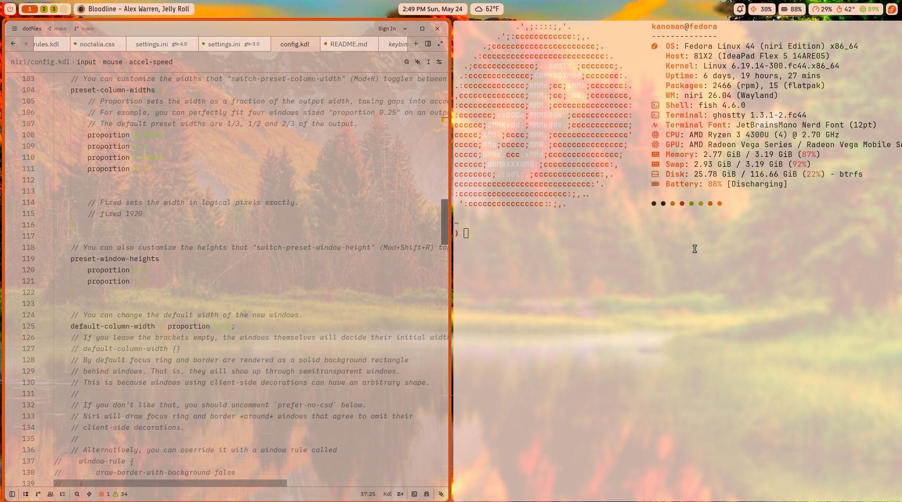

# **My niri dotfiles**
Here are my custom dotfiles that use the [niri](https://github.com/niri-wm/niri) scrollable tiling window manager.

## **The specs**
- [Noctalia Shell](noctalia.dev) for a desktop shell
- [Ghostty](ghostty.org) as my terminal of choice
- [Zed](zed.dev) and [VS Code](code.visualstudio.com) as my text editors (and maybe helix in the future)
- mostly GTK apps,
- and [fish](fishshell.com) as my terminal shell.

## **How to apply**
To apply these dotfiles, follow these steps.
1. install btop, fastfetch, fish, ghostty, niri, and noctalia if they arent installed already.
2. If these folders, which are btop, fastfetch, fish, ghostty, gtk-3.0, gtk-4.0, helix, niri, noctalia, qt5ct, qt6ct, or .zshrc exist in .config, add .old to them. Then make a folder called dotfiles in .config, and copy all the folders from the repo download, and symlink them into .config.
3. symlink the Wallpapers folder into your pictures folder.
## **Keybinds**
See [keybinds.md](keybinds.md) for a list of all keybinds.

## **Photos**
Here's some sleek photos of my rice:

